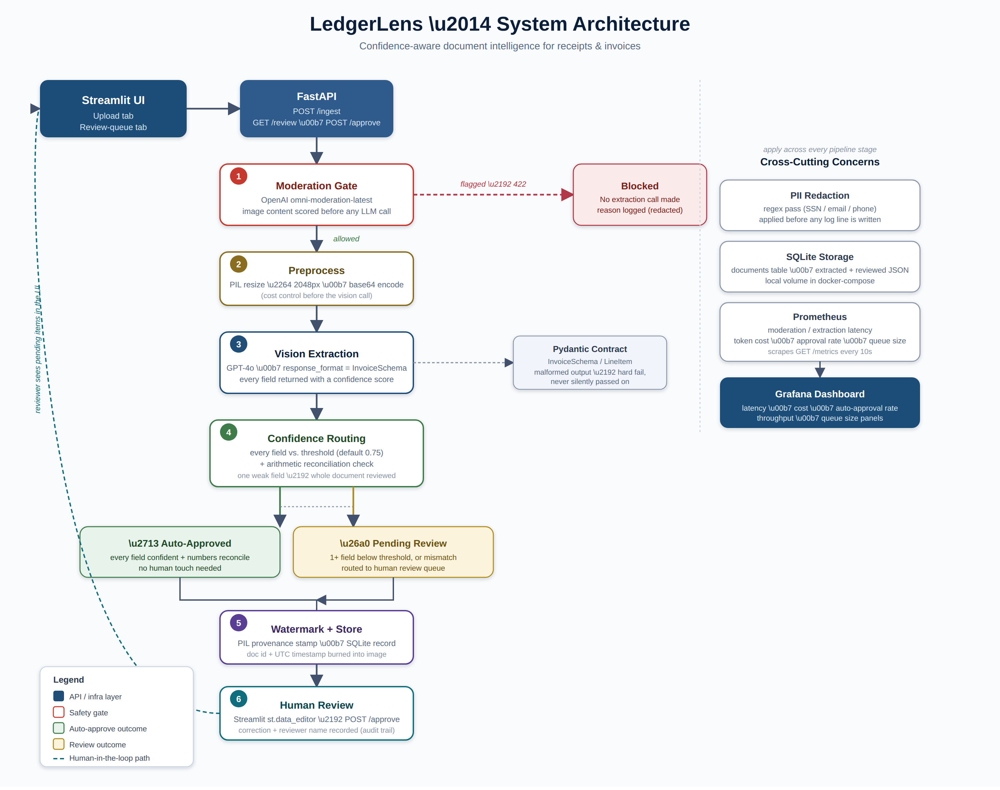

# LedgerLens

Confidence-aware document intelligence for receipts and invoices.

Drop in a photo of any receipt or invoice, get schema-validated structured
data back with a per-field confidence score, and let anything the model
wasn't sure about fall into a human review queue instead of being silently
trusted. No custom parser per vendor - one pipeline handles all of them.

Built for IITR-SE-2509, Cohort C, Capstone C·02 (Document Intelligence).

---

## Architecture, in one paragraph



An uploaded image passes through the OpenAI Moderation API before anything
else happens. If it clears that gate, it's resized for cost control and
sent to GPT-4o with `response_format` bound to a Pydantic schema, so the
model's output is either a valid `InvoiceSchema` or the call fails loudly -
never a malformed record slipping through. Every extracted field carries
its own confidence score. If every field clears the configured threshold
*and* the numbers reconcile (line items + tax roughly equal the total),
the document is auto-approved. Otherwise it's watermarked, stored, and
placed in a review queue that a human clears through a small Streamlit UI.
FastAPI exposes the three endpoints that matter (`/ingest`, `/review`,
`/approve`), and Prometheus/Grafana track latency, cost, and the
auto-approval rate.

```
Upload → Moderation gate → Preprocess → GPT-4o extraction (Pydantic schema)
       → Confidence routing → Watermark + store → [auto-approved | review queue]
       → Human review (Streamlit) → Approved record
```

See `app/main.py` for the exact sequence, or the design doc for the full
rationale behind each stage.

---

## Project layout

```
app/
  main.py                 FastAPI app - /ingest, /review, /approve, /health, /metrics
  config.py                Env-driven settings
  db.py                     SQLAlchemy model + session handling
  metrics.py               Prometheus instrumentation
  models/schemas.py        InvoiceSchema, LineItem, request/response contracts
  services/
    moderation.py           OpenAI Moderation gate
    extraction.py            GPT-4o vision extraction
    confidence.py            Threshold + reconciliation routing logic
    watermark.py             PIL provenance stamping
    redaction.py              PII regex redaction for logs
streamlit_app.py            Upload UI + reviewer queue UI
tests/                      pytest suite (schema, routing, moderation, redaction, API)
.github/workflows/ci.yml    Lint → test → docker build → (optional) Cloud Run deploy
Dockerfile
docker-compose.yml           api + streamlit + Prometheus + Grafana, one command
prometheus.yml
grafana/provisioning/        Pre-wired datasource + dashboard
```

---

## Running it locally (fastest path)

Requires Python 3.12 and an OpenAI API key with GPT-4o + moderation access.

```bash
cp .env.example .env
# edit .env and set OPENAI_API_KEY

python -m venv .venv
source .venv/bin/activate          # Windows: .venv\Scripts\activate
pip install -r requirements-dev.txt

# terminal 1
uvicorn app.main:app --reload

# terminal 2
streamlit run streamlit_app.py
```

- API + Swagger docs: http://localhost:8000/docs
- Streamlit UI: http://localhost:8501

## Running it with Docker Compose (matches the deployed setup)

```bash
cp .env.example .env
# edit .env and set OPENAI_API_KEY

docker compose up --build
```

- API: http://localhost:8000
- Streamlit UI: http://localhost:8501
- Prometheus: http://localhost:9090
- Grafana: http://localhost:3000 (anonymous viewer access enabled; admin/admin if you need to edit)

## Running the tests

```bash
pip install -r requirements-dev.txt
ruff check app tests streamlit_app.py
pytest -q
```

All 55 tests run without a real OpenAI key - the OpenAI client is mocked
at the service boundary in every test that would otherwise need one.

---

## Deployment

The GitHub Actions workflow (`.github/workflows/ci.yml`) lints, tests, and
builds the Docker image on every push. If `GCP_PROJECT_ID` and `GCP_SA_KEY`
repo secrets are configured, it also deploys to Cloud Run on `main`. If
they aren't, that step is skipped cleanly and the local `docker compose up`
path above is the documented fallback, per the submission requirements.

**Known limitation:** Cloud Run's local filesystem is ephemeral. As
deployed here, `LEDGERLENS_DB_URL` (SQLite) and the `uploads/` directory
reset on cold start or scale-to-zero. That's an accepted trade-off for
this project's scope - see `BUILD_NOTE.md` for the full reasoning and the
straightforward fix (GCS + Cloud SQL) if this were going further.

---

## Configuration

Every knob lives in `app/config.py` and is set via environment variable -
see `.env.example` for the full list, including the confidence threshold,
moderation block threshold, and model selection.
